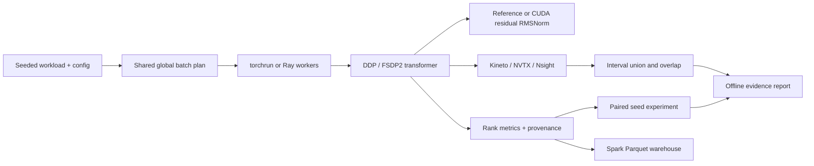

# Architecture and invariants

## Workload planning

For each epoch, every rank independently generates the same deterministic permutation
of sample IDs. A global batch contains `world_size × batch_size` IDs. The random,
length-clustered, and variable-cardinality greedy plans are candidates for assigning
those same IDs. Every rank receives at least one sample and at most `2 × batch_size`.
Incomplete global batches are dropped; the manifest records their count.

For a right-padded causal transformer, the attention proxy for a rank is
`B × (max(lengths) − 1)²`. Equal-cardinality planners cannot reduce the maximum proxy:
the rank with the longest sequence always executes `batch_size × longest²` work.
Unequal cardinality is the essential intervention. The greedy planner seeds each rank
with a long sequence, then assigns remaining samples using the smallest resulting
maximum proxy. The final plan minimizes `(maximum cost, total cost)` among all three
candidates. Including the random candidate proves **proxy non-regression**, not global
optimality or real-time improvement.

Padding, MLP cost, vocabulary projections, kernel selection, collective timing, and
launch overhead complicate the relationship between this proxy and wall time. The
planner is homogeneous: it does not currently calibrate different GPU speeds. Its
sample-count bound does not prove a model will fit in GPU memory.

