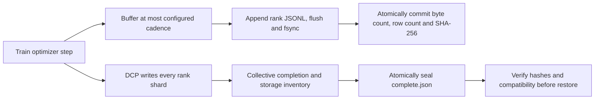

# Durable telemetry and verified checkpoint selection

Version 0.4 makes failure behavior an executable contract. The two rank-local states
below are deliberately separate: completed metric rows can survive even when the
optimizer checkpoint for that step was interrupted.

## Journal semantics

`metrics_flush_every` defaults to 32. Each rank buffers at most that many metric rows,
loss scalars, and CUDA event pairs before flushing. The end of a successful run always
flushes the remaining rows. Rank 0 gathers only constant-size metadata from each rank;
metric rows never travel through an end-of-run object collective.

For CUDA, flushing synchronizes the last buffered end event before materializing losses
and elapsed times. CPU flushing also introduces filesystem work. Runs with mid-loop
flushes are marked `instrumented=true`; telemetry time and maximum buffered rows are
recorded separately. Checkpointing, planning, and flush work affect training-loop wall
time even though step timings exclude those operations. Do not infer end-to-end
throughput from step timing alone.

Set `metrics_flush_every=0` for a short diagnostic throughput run that defers all metric
collection until the end. This mode explicitly gives up bounded training telemetry
and crash progress. The CPU/GPU paired-throughput baseline configs choose this mode;
keep profiling/NVTX/diagnostic synchronization disabled too. Long runs should use the
bounded default and report instrumentation.

Each progress marker contains rank identity, start/last step, row count, committed byte
count, SHA-256, flush count, and completion status. It is written only after rank JSONL
has been flushed and synced. Readers hash the committed prefix in fixed blocks and
validate consecutive rank/step identities while streaming. A torn suffix past the
frontier is ignored for partial-job inspection. Completed-run summaries also require
exact file size and equality with the manifest's final progress markers.

`inspect-run` reports the minimum durable frontier across ranks and retains available
failure records. Missing, corrupt, or inconsistent completed ranks cannot become a
complete result. An abrupt process exit may prevent that rank from writing its own
failure record; the retained launcher logs are required evidence.

## Bounded summary semantics

Automatic training summaries and paired comparisons stream one row per rank per step.
They retain no per-step report list. Exact median and p95 values come from a temporary
SQLite table and sorted index, using the same linear interpolation as the in-memory
report. SQLite uses a 1 MiB page-cache target and disk temporary storage; disk usage is
linear in step count. This bounds retained metric rows, not total model, corpus-index,
planner, profiler, or operating-system memory.

Offline `summarize` retains step rows by default for inspection. Add `--aggregate-only`
for the external-quantile path. Both paths validate complete rank coverage, token
conservation, finite durations/costs/losses, warmup flags, and padding accounting.
Comparisons preserve exact step/token workload identity through a SHA-256 stream.
See [measured report memory](../results/telemetry-memory-cpu/README.md).

## Checkpoint protocol

DCP storage uses `overwrite=False`. After all ranks finish saving, rank 0 hashes every
`.metadata` and `__rank_index.distcp` storage file and writes schema-2 `complete.json`
with paths, sizes, hashes, config, world size, dataset/fleet identities, PyTorch version,
and an implementation hash of the model/objective/kernel files. The marker itself has
a canonical content hash. Commit errors are broadcast so peer ranks also reject the
save. A model contract hash is conservative: even harmless edits to those files require
an explicit compatibility decision outside automatic recovery.

Explicit restore verifies storage and compatibility on each rank before collective
loading. Ranks exchange errors and marker identities first. Automatic `--resume-latest`
inspects all `checkpoint-*` directories, rejects incomplete/corrupt/incompatible
candidates and checkpoints at or beyond the configured end, and chooses the highest
verified step. It records every eligibility decision. The same world size is required.
Data, fleet, architecture/objective, and runtime identities must match; step limit,
warmup, profiling, checkpoint cadence, and telemetry cadence may change.

Schema-1 checkpoints remain available for explicit legacy restores and the published
v0.3 proof. They lack storage seals and runtime/model hashes, so automatic selection
rejects them. Storage hashes detect accidental changes; they are not signatures or a
security boundary. Only load trusted DCP files. PyTorch does not guarantee checkpoint
compatibility across its versions; see its [DCP documentation](https://docs.pytorch.org/docs/2.8/distributed.checkpoint.html).

## Executable failure boundaries

The [interrupted-write experiment](../results/fault-recovery-cpu/README.md) aborts rank 1
inside a real DCP serialization stream after 4096 synced bytes, corrupts a later committed
checkpoint, and verifies exact fallback recovery. Separate real-rank tests reject an
asymmetric source/config, failed journal opening, and rank-0 commit error without hanging.

The [logical-node experiment](../results/logical-nodes-cpu/README.md) runs two independent
node agents on one host. Physical multi-host networking, remote filesystem semantics,
power loss, elastic world sizes, NCCL, GPU, and FSDP2 recovery remain unvalidated.
Filesystem durability depends on the storage system; local `fsync` experiments do not
establish remote or power-failure guarantees. SQLite cache behavior is documented in
[cache_size](https://www.sqlite.org/pragma.html#pragma_cache_size) and
[temporary files](https://www.sqlite.org/tempfiles.html).
